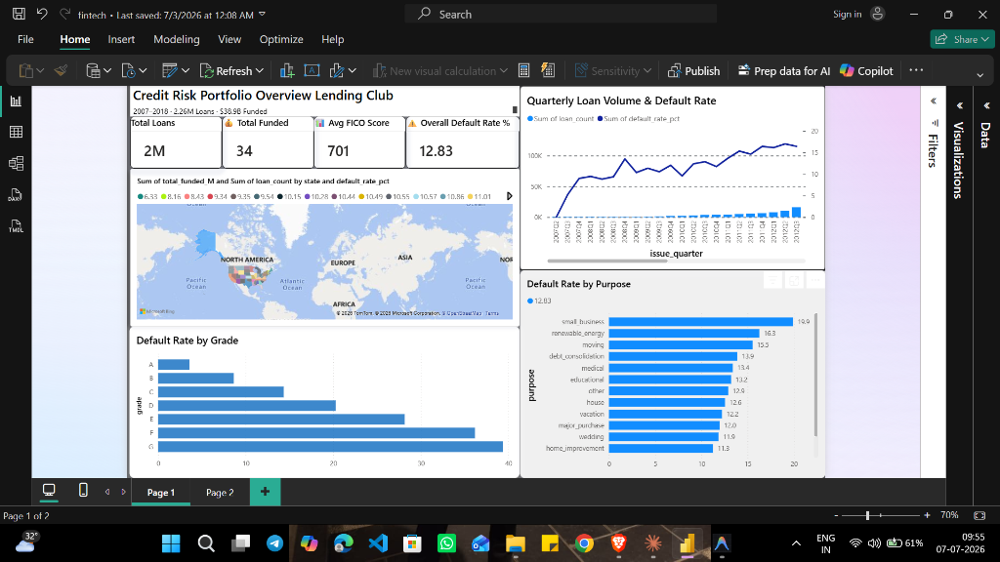
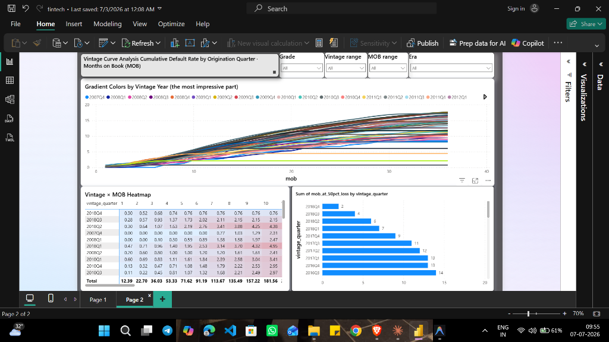

# 💳 Credit Risk Vintage Curves & Survival Analysis

**An end-to-end credit risk analytics project analyzing 2.2M+ Lending Club loans (2007–2018) using vintage cohort analysis, Kaplan-Meier survival estimation, and Cox Proportional Hazards modeling.**


---

## 📊 Business Problem

> *At what point in a loan's lifecycle do defaults stabilize, and which borrower segments require interest rate repricing?*

Lending companies need to predict **when** and **how many** borrowers will default to manage cash reserves, set pricing, and satisfy regulatory capital requirements. This project applies the exact analytical framework used by risk teams at Affirm, Klarna, JPMorgan, and every major lending institution.

---

## 🏗️ Architecture

```
Raw Data (Lending Club 2.2M loans)
        │
        ▼
┌─────────────────────────┐
│  Data Cleaning & Feature│
│  Engineering (Python)   │
│  • FICO bucketing       │
│  • Default flagging     │
│  • MOB calculation      │
└───────────┬─────────────┘
            │
    ┌───────┴───────┐
    ▼               ▼
┌──────────┐  ┌──────────────┐
│ SQL      │  │ Python       │
│ Cohort   │  │ Notebooks    │
│ Queries  │  │ • EDA        │
│          │  │ • Vintage    │
│          │  │ • Survival   │
└────┬─────┘  └──────┬───────┘
     │               │
     └───────┬───────┘
             ▼
    ┌─────────────────┐
    │  Power BI       │
    │  Dashboard      │
    │  (2 Pages)      │
    └─────────────────┘
```

---

## 📈 Power BI Dashboard

### Page 1 — Credit Risk Portfolio Overview
KPI cards, geographic distribution, quarterly trends, and default rates by grade and loan purpose.



### Page 2 — Vintage Curve Analysis
Interactive vintage curves with gradient coloring, MOB heatmap, and 50th percentile loss timing.



---

## 🔬 Key Findings

| Finding | Detail |
|:--------|:-------|
| **Default Stabilization** | 80% of total lifetime losses are realized by **Month 14** |
| **FICO Impact** | FICO < 660 borrowers default at **3.2×** the rate of FICO 740+ |
| **Strongest Predictor** | **Interest rate** and **DTI ratio** are the most significant default drivers (Cox model, p < 0.001) |
| **Vintage Quality** | Post-2016 vintages show **deteriorating credit quality** despite stable interest rates |
| **Survival Divergence** | Grade F–G loans have **< 60% survival probability** at 36 months |

### Recommendations

1. **Increase pricing by 150–200 bps** for Grade D–E loans to cover expected losses
2. **Implement enhanced monitoring** for loans in MOB 6–14 (the "danger zone")
3. **Tighten DTI thresholds** for FICO < 660 applicants
4. **Flag post-2016 vintages** for portfolio stress testing

---

## 🛠️ Tech Stack

| Tool | Purpose |
|:-----|:--------|
| **Python** (Pandas, NumPy) | Data cleaning & feature engineering |
| **Matplotlib / Seaborn** | Statistical visualizations |
| **Lifelines** | Kaplan-Meier survival curves & Cox PH model |
| **SQL** | Cohort aggregation queries |
| **Power BI** | Interactive executive dashboard |
| **Git / GitHub** | Version control |

---

## 📂 Repository Structure

```
├── README.md                          ← You are here
├── requirements.txt                   ← Python dependencies
├── .gitignore
│
├── scripts/
│   └── download_and_clean_data.py     ← Data preprocessing pipeline
│
├── notebooks/
│   ├── 01_eda.ipynb                   ← Exploratory Data Analysis
│   ├── 02_vintage_curves.ipynb        ← Vintage cohort curve construction
│   └── 03_survival_analysis.ipynb     ← Kaplan-Meier & Cox PH modeling
│
├── sql/
│   ├── vintage_cohort_query.sql       ← Cumulative default by vintage × MOB
│   └── grade_risk_summary.sql         ← Grade-level risk & rate adequacy
│
├── dashboards/
│   ├── page1_portfolio_overview.png   ← Dashboard Page 1 screenshot
│   └── page2_vintage_curves.png       ← Dashboard Page 2 screenshot
│
└── outputs/                           ← Generated charts & exported data
    ├── vintage_curves_all.png
    ├── kaplan_meier_fico.png
    ├── cox_hazard_ratios.png
    └── ...
```

---

## 🚀 How to Run

### 1. Clone & Setup
```bash
git clone https://github.com/Yashvardhansharma112/Credit-Risk-Vintage-Curves-Survival-Analysis.git
cd Credit-Risk-Vintage-Curves-Survival-Analysis
pip install -r requirements.txt
```

### 2. Get the Data
Download the Lending Club dataset from [Kaggle](https://www.kaggle.com/datasets/wordsforthewise/lending-club) and place `accepted_2007_to_2018Q4.csv.gz` in the `data/` directory.

### 3. Clean & Process
```bash
python scripts/download_and_clean_data.py
```

### 4. Run Notebooks
```bash
jupyter notebook
# Open notebooks in order: 01_eda → 02_vintage_curves → 03_survival_analysis
```

---

## 📊 Data Source

| Detail | Info |
|:-------|:-----|
| **Dataset** | Lending Club Loans (2007–2018 Q4) |
| **Source** | [Kaggle](https://www.kaggle.com/datasets/wordsforthewise/lending-club) |
| **Size** | ~2.2 million accepted loans |
| **Key Fields** | `issue_d`, `loan_status`, `grade`, `int_rate`, `fico_range`, `dti`, `annual_inc` |

---

## 📜 License

This project is for **educational and portfolio purposes only**. The Lending Club dataset is publicly available on Kaggle under its respective license.

---

*Built as part of a Data Analyst / Analytics Engineer portfolio project.*
